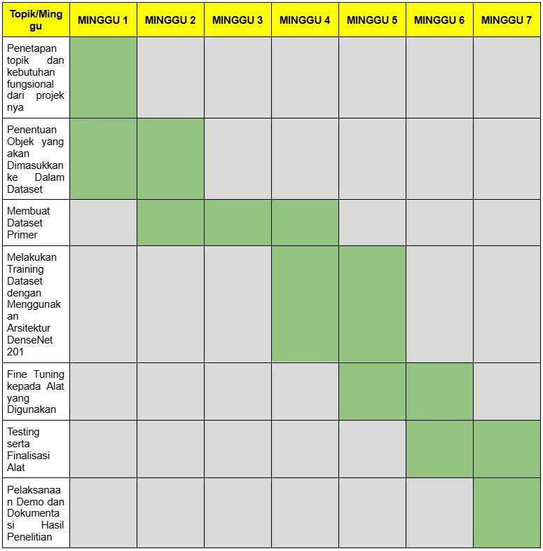

# Sistem Klasifikasi Sampah Menggunakan Raspberry Pi 4 dengan model DenseNet 201

### Nama dan NIM Anggota Penyusun
Proyek akhir ini merupakan salah satu tugas yang diberikan oleh mata kuliah _Edge Intelligence and Computing_ dimana Dosen Pengampu dari kelas ini adalah:
Bpk. Dahnial Syauqy S.T., M.T., M.Sc.

Berikut merupakan lampiran mengenai identitas penyusun proyek ini sehingga dapat berjalan dengan lancar:
1. Arya Pradipto (215150300111014)
2. Muhammad Zaidan Albert (215150300111001)
3. Rifqi Aditya Fadhil (215150300111015)
4. ⁠Gregorio Manoeroe (215150300111019)

### Jadwal serta Pembagian Tugas

### _PowerPoint_ Presentasi Proyek
Berikut merupakan lampiran untuk menuju ke Materi Presentasi Akhir:
**https://www.canva.com/design/DAGQpNNKtqQ/HjHT1XfNjJNxt9ZHl9qfNw/edit?utm_content=DAGQpNNKtqQ&utm_campaign=designshare&utm_medium=link2&utm_source=sharebutton**

## Penjelasan Proyek Akhir
Projek ini bertujuan untuk mengimplementasikan sebuah sistem yang dapat mengidentifikasi dan mengklasifikasikan jenis sampah dengan menggunakan _Edge Devices_ dan sebuah perangkat komputasi berupa Raspberry Pi 4.

### Tujuan Pengembangan Sistem
- Sampah masih menjadi masalah besar yang dihadapi hampir seluruh negara di dunia, termasuk Indonesia. Berdasarkan data dari Sistem Informasi Penanggulangan Sampah Nasional (SIPSN) pada tahun 2023, timbulan sampah di Indonesia mencapai 35,74 juta ton per tahun, meskipun jumlah ini sedikit menurun sebesar 7,47% dari tahun 2022.
- Sampah sering tidak dipilah dengan benar karena rendahnya kesadaran masyarakat dan keterbatasan infrastruktur. Selain itu, pemilahan manual kurang efisien dan akurat, sehingga diperlukan pendekatan teknologi yang lebih baik yaitu alat yang dapat mengidentifikasi dan klasifikasi sampah secara otomatis.
- Maka dari itu, di projek ini dibuat sebuah alat yang dapat mengidentifikasi dan mengklasifikasi sampah menggunakan algoritma dari CNN (Convolutional Neural Network) yagn berjudul DenseNet201 untuk mengidentifikasi dan mengklasifikasi empat jenis sampah yaitu, Anorganik, Organik, B3, dan Residu.

### Rumusan Masalah Proyek
- Berapa jumlah nilai _accuracy_ yang didapatkan oleh model DenseNet201?
- Bagaimana hasil _Confusion Matrix_ model DenseNet201?
- Bagaimana Hasil akurasi inferensi pada sistem identifikasi sampah?

## Implementasi Proyek
Pada bagian ini, akan disusun mengenai rekayasa dari perangkat lunak dan perangkat keras yang digunakan pada proyek untuk membangun sistem guna mengidentifikasi dan mengklasifikasikan jenis sampah.

### Diagram Keseluruhan Sistem

### Dataset Penggunaan Training
Lampiran berikut merupakan kumpulan dari citra sampah yang digunakan sebagai _Dataset_ untuk _Training_ dari algoritma DenseNet201.
**https://drive.google.com/drive/folders/1vJfYpHzuwcTGsy4mfbU9OAFK83DhpFdH**

### Rekayasa Perangkat Keras
- **Raspberry Pi 4 Model B Ram 4 GB**: _Single Board Computer_ yang digunakan sebagai perangkat komputasi utama dalam sistem.
- **Logitech Webcam C270**: Perangkat yang digunakan untuk mengambil citra dari sampah yang akan diklasifikasi.
- **Servo SG90 180**: Perangkat yang digunakan untuk menggerakan katup pada tempat sampah.

### Datasheet Raspberry Pi 4 Model B

### Diagram Skematik Sistem

## Proses Demo dan Evaluasi Sistem
- **Persiapan**: Proses untuk menghubungkan setiap komponen yang digunakan dalam sistem dan mengunggah kode program ke dalam perangkat komputasi Raspberry Pi 4 Model B.
- **Demonstrasi**: Melakukan demonstrasi alat untuk mengidentifikasi dan mengklasifikasikan jenis sampah yang dideteksi pada kamera
- **Evaluasi**: Melakukan proses pengujian di menggunakan jenis sampah yang berbeda-beda.

### Hasil Akhir Sistem

### Demo Pengimplementasian Sistem
Video demonstrasi dari keseluruhan sistem dan penggunaannya dapat dilihat pada lampiran berikut:
**https://github.com/plotwes/Edge_Intelligence_Automatic_Waste_Classification/blob/main/assets/test-demo-alat.mp4**

## Kesimpulan
Pada penelitian ini didapatkan nilai epoch terbaik dari hasil pengujian dengan menggunakan callbacks adalah epoch ke‐20. Selanjutnya, untuk rata‐rata waktu komputasi secara keseluruhan yang didapatkan oleh sistem yaitu 4,2239675 detik. Terakhir, Hasil integrasi pada sistem yang didapatkan yaitu nilai akurasi sebesar 92,5%, dimana masih terdapat beberapa integrasi yang salah pada kelas Anorganik.
